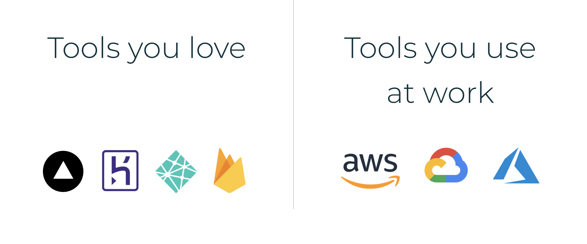

# Introduction

**There's something strange in the way we build software today.**

Cloud providers like AWS are extremely complex. Without prior DevOps expertise it can take many days to set up. There are great "no-ops" platforms like Vercel and Heroku out there, but their use is limited to small projects. Most teams keep building on AWS, GCP or Azure – because they know that eventually they will need some of the 200+ services that only big cloud providers have.

So you are forced to choose between great developer experience and building a future-proof stack. **This is wrong.** Imagine if mobile developers needed one set of tools to _start_ building an app, and had to rebuild it with entirely different tools after a year or so – wouldn't that be ridiculous?

## Digger makes AWS simple
It automatically generates infrastructure for your code in your AWS account.
So you can build on AWS without having to deal with its complexity.

You can launch in minutes and get a future-proof stack at the same time. No need to build from scratch, or even think of infrastructure at all

- ✅ Easy to use Web UI + powerful CLI
- ✅ Deploy webapps, serverless functions and databases: just connect GitHub repositories
- ✅ Multiple environments: replicate your entire stack in a few clicks. Dev / staging / production; short-lived for testing; per-customer
- ✅ Zero-configuration CI with GitOps: pick a branch for each environment and your services will be deployed on every git push
- ✅ Logs, environment variables, secrets, domains: never touch AWS again!

## You keep the full power of AWS

Traditional PaaS like Heroku or Vercel run your code on their servers. Digger takes a different approach: it generates infrastructure-as-code (Terraform) that in turn configures your AWS account.

Digger is quick and simple for the most common scenarios, but there are no limitations on what you can build with Digger. Terraform is industry standard for all things DevOps; you can customise it or even use your own templates with Digger. So unlike with PaaS, you never outgrow Digger - because you get a future-proof stack from day 1.

## Why Amazon hasn't done it?

Great question. Neither did Microsoft, nor did Google. We believe this is because complexity is one of the few lock-in levers still available to major cloud providers.

AWS, GCP and Azure are essentially identical these days for the 95% of tasks at hand – but they don't want to make it easy for you to move to a different provider. So they lure you in with free credits, and then even if you aren't building anything unique you are unlikely to move – because you have invested lots of time in learning it.