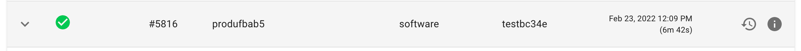

# Project customisation

## Single view vs Advanced view

Single view is a simplified version of Digger that allows to manage simple project in a single page. It is limited to a single service and a single environment. Whenever addition services or environments are added, single view will become unavailable for the project.

Advanced view is the full Digger project experience that allows full customisation. It is available for all projects and is the way to create addition services, environments or resources. Database and routing options are only available in the advanced view.

The users can toggle their preference using the toggle button at the bottom of the page and if available, the user will be able to switch between single and advanced views.

## Create a database for a project

In Digger, databases are resources which can be created inside an environment.

Steps to create a new resource are as follows:
1. Go to your projects environments tab (if in single view, advanced view will have to be toggled) 

2. Click on the `+ ADD RESOURCE` button 

3. Select the type of resource you would like to create 

4. Customise the selection and deploy the resource 

The resource will be deployed right away and its status can be found in the `Deployments` tab.

## Change a projects name

Steps to update a project name are as follows:
1. Press on the edit icon on the right side of the project 
2. Choose a new name and press save 

## Deleting a project

In Digger, to delete a project, all of the existing environments need to be deleted first. After the environments are deleted, the user can proceed to deleting the project.

Steps to delete a project are as follows:
1. Press on the delete icon on the right side of the project 
2. Depending on the status of the environments the user will get one of the screens
   1. There are still environments that need to be delete in the project. Their names will be listed and the `Delete` button will be disabled. 
   2. There are no environments in the project. The user will be given the option to complete the deletion 

## Change service configuration
After creating a service, you might want to adjust the configuration at some point down the line

#### That can be done following these steps in single view:
1. Press on the `Edit` button in the service section 
2. Update the field as required 

#### That can be done following these steps in advanced view:
1. Press on the `Details` button on the service that need changing 
2. Press on the `Edit` button at the bottom of the page 
3. Update the field as required 

In both cases, after confirming the changes, you will be offered the option to redeploy right away so all the changes are instantly applied.
Otherwise, the changes will be applied following a merge into the default git branch.

*Note: available fields will differ on the type of service that's being updated*

## Change environment configuration

#### To adjust in single page view
1. Press on the edit button 
2. Update the values as required 
   1. In this view AWS keys can also be changed for this environment only 
3. Confirm the selection. *Note: since target cannot be changed in single view, you will not get a redeployment popup*

#### To adjust in advanced view
1. Select the environment that needs updating 
2. Press on the edit button 
3. Update the values as required 
   1. In this view AWS keys can also be changed for this environment only 
4. Confirm the selection. You will be offered the option to redeploy the environment to apply the changes. 

## Quick redeploy to previous version of the service
In Digger, users can easily redeploy their services to previous version.

#### In single view
1. Find the redeployment button on the right side of the deployments 
2. You will be prompted to confirm the redeployment
3. Your resource will run through the deployment stages and be redeployed.
4. When successful, a green tick will appear near the deployment that is currently live

#### In advanced view
1. Go to your projects `Deployments` tab
2. Find the redeployment button on the right side of the deployments 
2. You will be prompted to confirm the redeployment
3. Your resource will run through the deployment stages and be redeployed.
4. When successful, a green tick will appear near the deployment that is currently live

## Digger limitations
### Containers and lambdas in the same project

Digger currently does not support container and lambda services in the same project.
Separate projects will need to be created for container and lambdas

### Databases and lambdas in the same project

Digger currently does not support databases and lambda services in the same project.
Separate projects will need to be created for databases and lambdas

