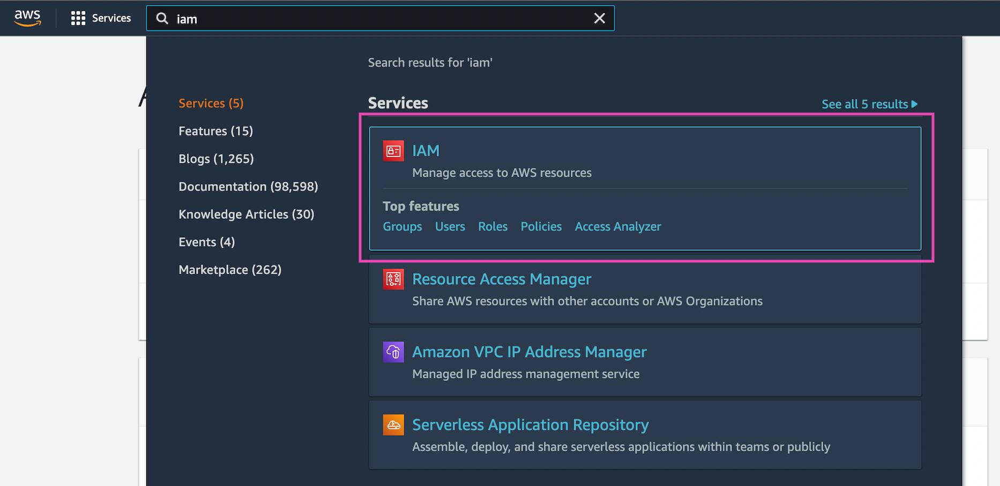
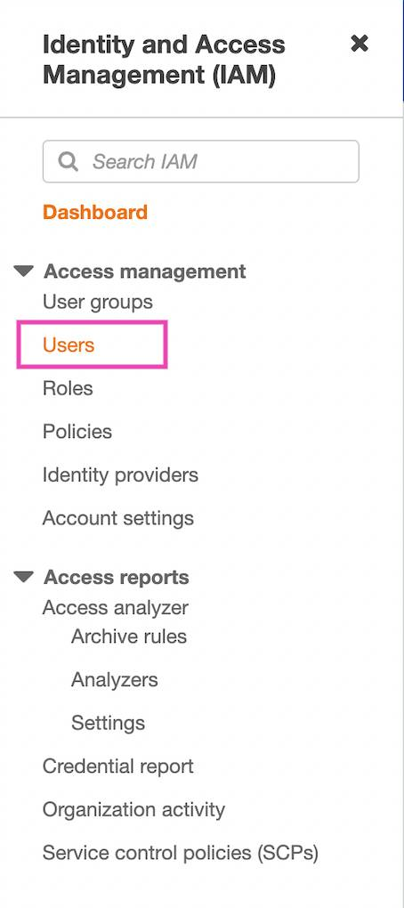
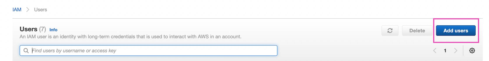
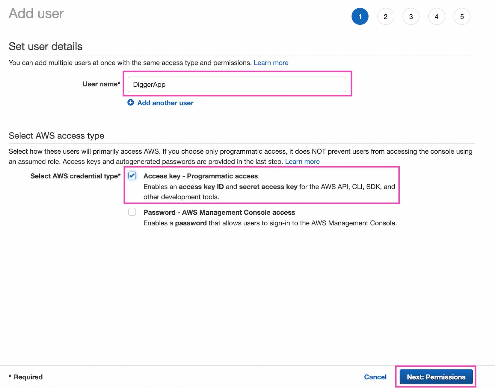
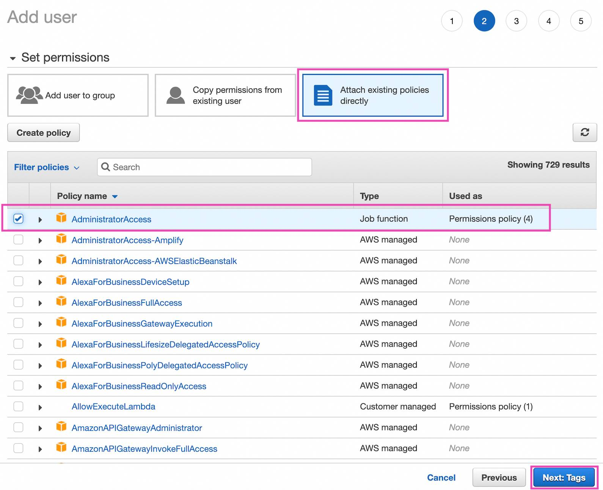
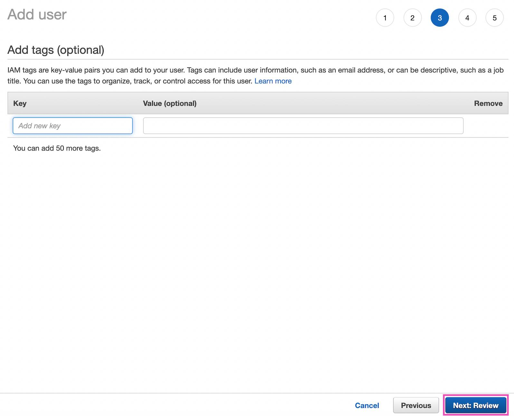
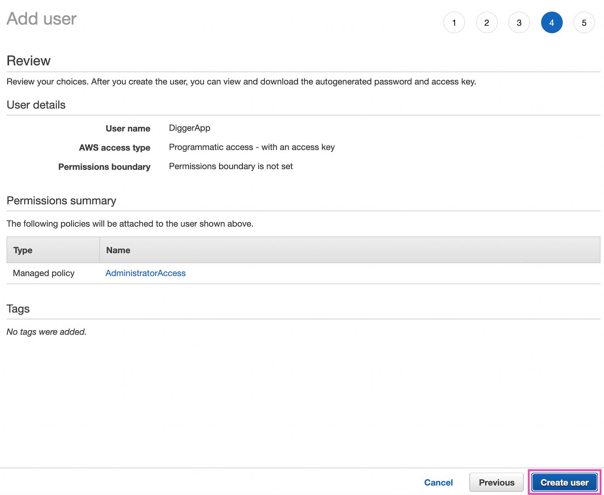
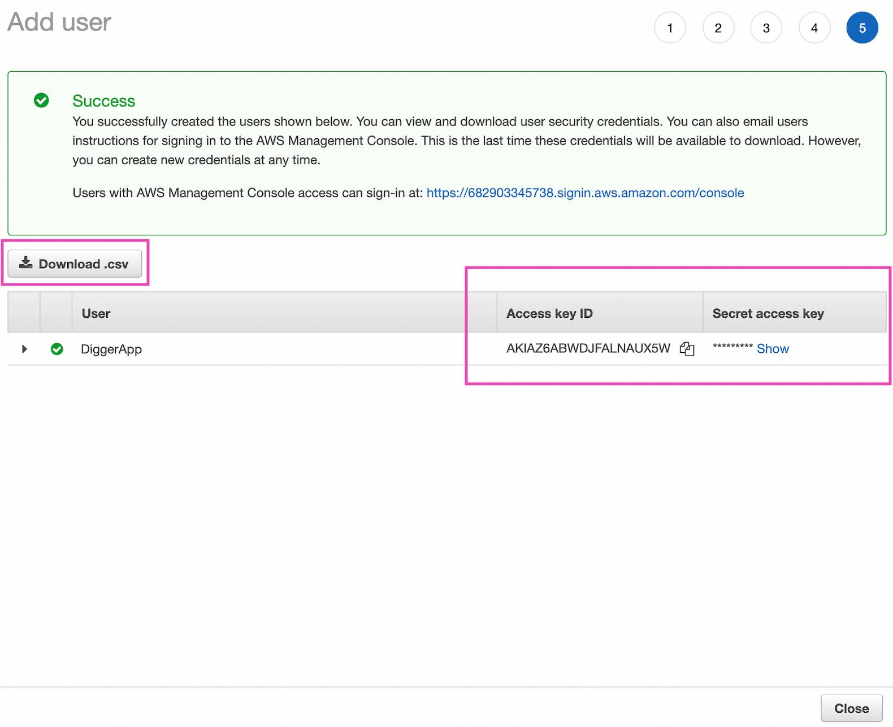

# Creating AWS keys

To use digger, you will have to provide AWS keys, so Digger could seamlessly deploy your application on AWS
infrastructure

To get the keys, an AWS account is required.

After registering with AWS, you will have to complete these steps:

1. Login to AWS.
2. Proceed to the `IAM` page
   
3. Press on `Users`  
   
6. Press on `Add users`.
   
7. Enter your chosen user name, for example: `DiggerApp`
8. Press on the `Access key - Programmatic access` checkbox
   
9. Select `Attach existing policies directly`
10. Press on the checkbox near `AdministratorAccess`
11. Press `Next: Tags`
    
12. Press `Next: Review`
    
13. Double check that the required permissions are there and press `Create user`
    
14. Press on `Download .csv` and save it on your machine. It contains the AWS access keys for later. For now, you can
    copy `
    Access key ID` and `Secret access key`, return to the Digger app to continue your deployment from there.
    
